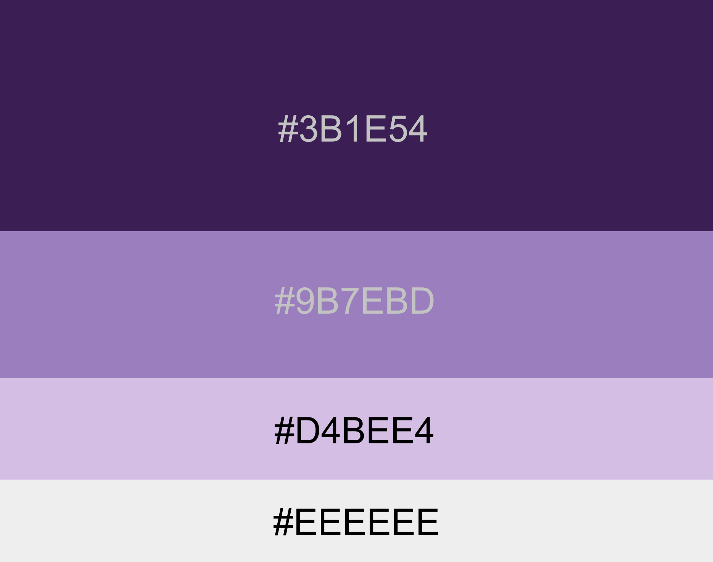

# Deadline : 1 November (cleared)

## Completion Method : Collab in GitHub

## Page yang dibuat :

  - adminProduct.php
    
      > Admin page for register product and delete registered product.
  - registerProcess.php
      > handle register process.
  - adminProductProcess.php
      > Backend process for adminProduct page (retrieving and insert to database).
  - cart.php
      > Cart product page.
  - home-page.php
      > Halaman utama produk-produk.
  - cartProcess.php
      > Handling for product insertion to user cart.
  - cartRegistry.php
      > Handling display for user's cart item.
  - cartRemoval.php
      > Handling deletion item from user's cart.
  - deleteProduct.php
      > Interface for admin to takedown registered product.
  - deleteProductProcess.php
      > Handling product tekaedown in admin's store.
  - home-page.php
      > Starting page (main page).
  - homeProcess.php
      > Loading registered products to home-page.
  - login-page.php
      > Login page (user / admin)
  - loginProcess.php
      > Handling process for account verification with email and password.
  - logoutProcess.php
      > Handle log out process
  - product-details.php
      > Dedicated page for each product with id based.
  - productRegistry.php
      > Loading display of the products into the deleteProduct page.
  - profile-dashboard.php
      > User / Admin prodile dashboard.
  - profileProcess.php
      > Handling logic behind user / admin's profile data.
  - register-page
      > Register page for creating account.
  - registerProcess.php
      > Handling for account creation with username, email, and password.
  - thank-you.php
      > Landing page for successfull transaction after checkout succeed.

## Color Theme :
  
  > #3B1E54 | rgb(59, 30, 84)

  > #9B7EBD | rgb(155, 126, 189)

  > #D4BEE4 | rgb(212, 190, 228)

  > #EEEEEE | rgb(238, 238, 238)

  
## DBMS  : mysql 
## Database : e-commerce_db
